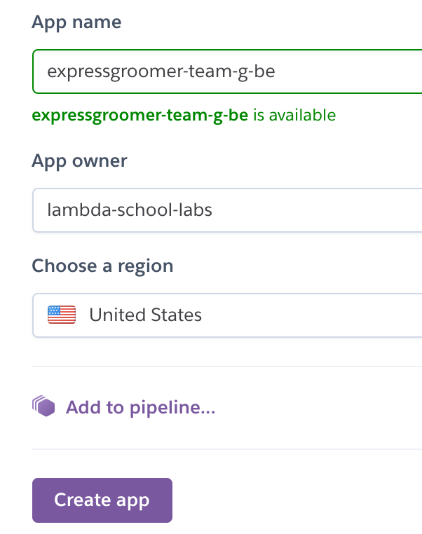
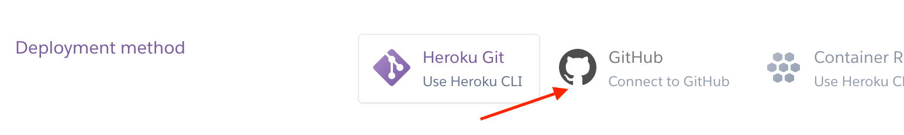
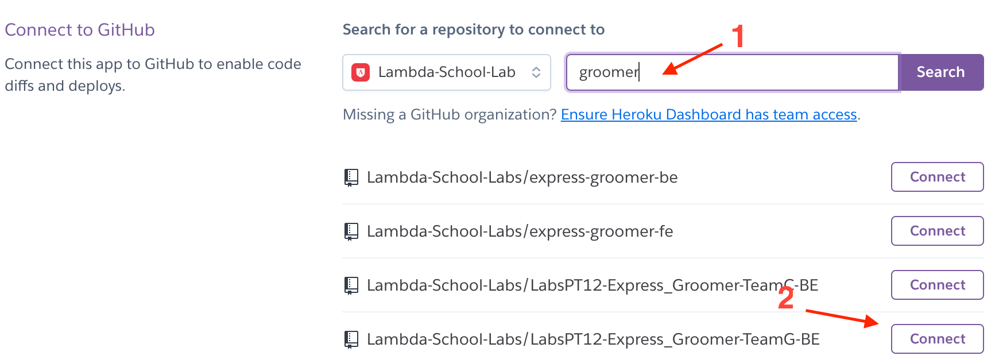
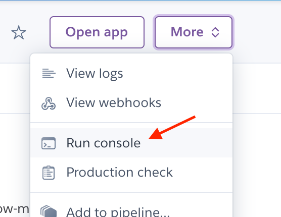
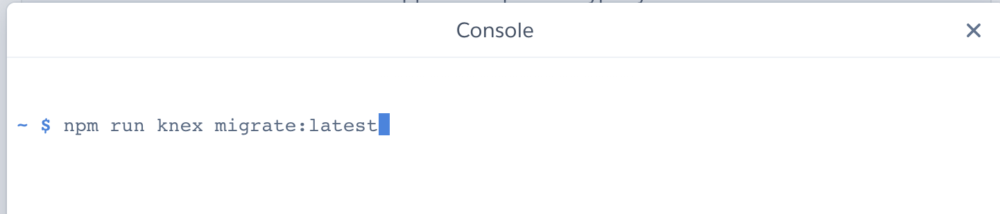

# Heroku Node Deployment

As `Associate Product Lead` and `Technical Project Leads` you'll be responsible for provisioning Heroku accounts for your students, configuring the applications to use a `Postgres` addon, and granting access to the provisioned app to the students who need it \(should be WEB students primarily\).

Currently only APLs will have full admin access to apps.

There are some settings any team member can perform, eg. `Environment Variables`

## Steps to setting up and provisioning Heroku apps - APLs

If you haven't gotten admin access to Heroku yet please ask you engineering manager to set that up using your `Lambda School Student Email` \(@lambdastudents.com\)

1. Log into the Heroku console using your Lambda issued student email.

   _You should have received access to the console from your engineering manager._

2. Click on the `New` button in the top right corner
3. Name the app using our Labs naming convention: `productname-team-api` i.e.

   `ecosoap-a-api`

### Configuring the `PostgresQL` add-on - APLs

1. Select the app and click on `Overview`
2. Select `Configure Add-ons`
3. Search for `Postgres` and `Heroku Postgres` should appear in the list of options
4. Select `Heroku Postgres` and select -&gt; `Hobby Basic - $9.00`
5. Select `Provision`

### Adding Members to the provisioned app - APLs

1. Once the app is created click on the app and select the `access` tab
2. Click `Add Member` and add your students \(please use their lambda issued emails\) and TPL to the app as making sure that `View`, `Deploy`, `Operate` boxes are all selected. Click `Save Changes`

3. Your students should receive an email granting them access to their console; follow up and make sure they are able to get in

*Note: For build-ons, you'll be adding students to an existing Heroku app.*

### Environment Variables - Any team member with access

1. From the application tab navigation select `Settings`
2. Select `Reveal Config Vars`
3. \*\*You should already see a `DATABASE_URL` assigned to the postgres add-on you

   set up\*\*

4. Add all the proper environment variables

### Deployment - APLs

#### Setup

1. From the application tab navigation select `Deploy`
2. Select the `GitHub` "Deployment Method"
3. Find the `Connect to GitHub` section and select `Lambda-School-Labs`
4. Find your app and select `Connect`
5. Deploy from the `main` branch
6. Select `Wait for CI to pass before deploy`
7. `Enable Automatic Deploys` so that anytime a branch is merged into main

#### First Deploy


There are 2 conditions where Heroku will likely not automatically deploy the app right after setup:

1. The events `push` for the main branch and `ci_complete` haven't triggered
2. There is no code in the repo yet 😬😂


When your repo is ready follow these steps to complete the deploy.

1. run a manual deploy by hitting the `Deploy Branch` button at the bottom of

   the page

2. Click `Open app`; you will see the `"api":"up"` message if all is well.
3. Using the heroku console run the following commands \(Alternatively you

   can use the heroku cli app\)

   1. `bash` then you can run the following commands from the shell
   2. `npm run knex migrate:latest`
   3. `npm run knex seed:run` this is optional if the team wants to start with

      5 profiles.

|   |   |
| :--- | :--- |
|  |  |

**Your team is now set up! Now when someone has a PR merged into `main` your team's app will update across the world wide web**

### Next Steps

Checkout how to [setup Review Apps](https://github.com/Lambda-School-Labs/gitbook-labs-guides/tree/f514baf6b1b0c2764cc2bce1739043d8ef763b96/heroku/heroku/review-apps/README.md) to have Heroku automatically deploy your app for each github PR that you create.

Optionally, See the [setting up a Custom Domain Guide](https://github.com/Lambda-School-Labs/gitbook-labs-guides/tree/f514baf6b1b0c2764cc2bce1739043d8ef763b96/heroku/heroku/heroku-custom-domain/README.md) to make sure that your API doesn't have the ugly `herokuapp` in it's URL.

