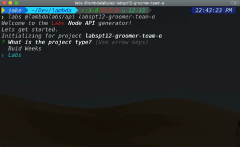

# Labs CLI Basics

The `labs` CLI command is a tool for generating greenfield projects or adding
new code pieces (components, pages, routes, models) to an existing project.

## Installation

The labs CLI command is a nodejs application and can be installed with the
following command:

`npm i -g @lambdalabs/labs`

running this command will install the following npmjs module and all associated
Labs generators that have been published:

[@lambdalabs/labs](https://www.npmjs.com/package/@lambdalabs/labs)

## Getting help

The Labs CLI command is a wrapper around the [yeoman](https://yeoman.io/learning/index.html)
cli app and generator system. You can view the `labs` CLI help by passing the
`--help` option:

`labs --help`

## using a generator

To use the CLI command follow this pattern and look at examples from specific
generators:

`labs <generator-name> arguments [options]`

### Prompt interface

If you only run `labs <generator-name> arguments` it will start a prompt based
UX to collect all options

