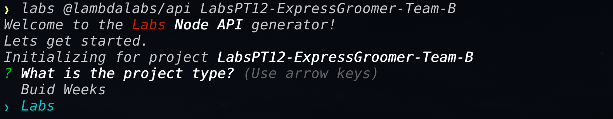
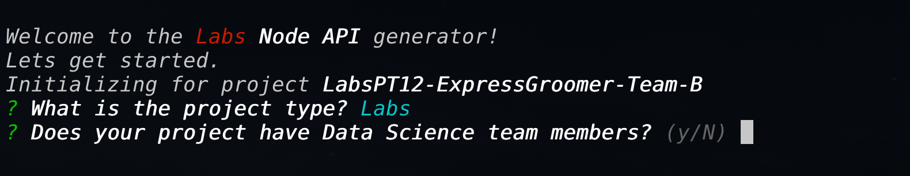
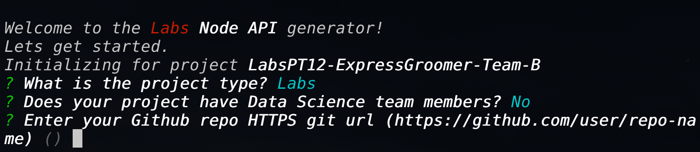

# Create a Labs Node API

The Node API generator is used by the [Labs CLI](https://github.com/Lambda-School-Labs/gitbook-labs-guides/tree/99d50db2598c8781016ceb9b1449fd8d3338d396/labs-cli/cli-basics/README.md) to generate greenfield SPA applications or add components.

This guide will walk you through the creation of a node express application with the following items setup:

* Resource endpoints for a user `Profile`
* Knex config and `Profile` model
* Secure routes suing middleware to **verify** Okta JWT
* tests for the `Profile` resource

## Installation

## Installation

The Labs React SPA generator is installed as a dependancy for the labs CLI, which is a nodejs application and can be installed with the following command:

`npm i -g @lambdalabs/labs`

Running this command will install the following npmjs module and all associated Labs generators that have been published:

[@lambdalabs/labs](https://www.npmjs.com/package/@lambdalabs/labs)

To see all the arguments and options visit the npmjs site for [Labs API Generator](https://www.npmjs.com/package/@lambdalabs/generator-api)

## Getting Started

Now lets look at creating a new application entirely from the CLI. This app will use the following info:

* \[Arg\] Project Name: `BW-ExpressGroomer-Team-C`
  * this should be the team/project name
* \[Opt\] Program: `BW`
* \[Opt\] Team has DS team members: `No`
* \[Opt\] Github repo url: `https://github.com/LambdaLabs/BW-expressgroomer-team-c-be.git`
  * this should be the same url you would clone from

### Run the command

Now lets plug that info into the `labs` CLI command:

`labs @lambdalabs/api BW-ExpressGroomer-Team-C --program=BW --hasDS=false --repoUrl=https://github.com/LambdaLabs/BW-expressgroomer-team-c-be.git`

All [options](https://www.npmjs.com/package/@lambdalabs/generator-api#prompts--options) have been satisfied so the `labs` CLI will start working doing the following work:

* generate Labs Node Express API folder structure
* generate files for an API app, resource examples with tests
* Update the package.json with Labs approved base config and libraries
* run `npm install`
* Initialize git repo
  * `git init`
  * rename the default branch to `main`
  * make initial commit
  * add Github url as remote `origin`
  * push repo to Github

Phew 😅, that's a lot.

## Same outcome, different UX

So now lets try creating the same app using the Prompts UX:

We'll use the same info as above except for the following:

* \[Arg\] Project Name: `LabsPT12-ExpressGroomer-Team-B`
* \[Opt\] github repo url: `https://github.com/LambdaLabs/BW-expressgroomer-team-b-be.git`

So let's run the `labs` CLI.

`labs @lambdalabs/api BW-ExpressGroomer-Team-B`

You will now need to answer the following prompts:

Choose `Labs` which should be highlighted by default. This will set the `--program` option. Onto the next prompt.

Answer `n` or `no` to set the `--hasDS` option as false.

Here we enter the entire `git` url to the repo. It should end with a `.git`

🚀 And away we go. The CLI should now be taking the exact same actions as mentioned above.

