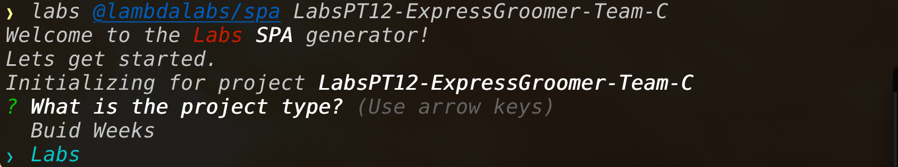
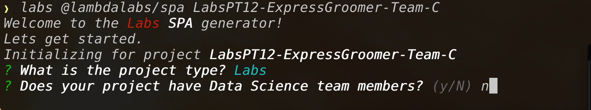
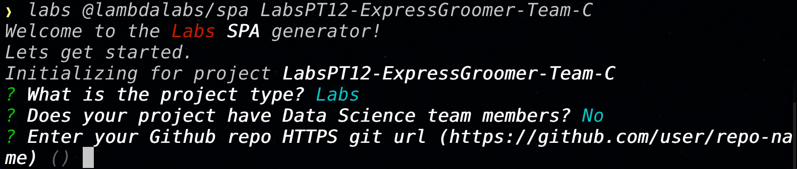

# Create a Labs React SPA

The React SPA generator is used by the [Labs CLI](https://github.com/Lambda-School-Labs/gitbook-labs-guides/tree/99d50db2598c8781016ceb9b1449fd8d3338d396/labs-cli/cli-basics/README.md) to generate greenfield SPA applications or add components.

## Installation

The Labs React SPA generator is installed as a dependancy for the labs CLI, which is a nodejs application and can be installed with the following command:

`npm i -g @lambdalabs/labs`

Running this command will install the following npmjs module and all associated Labs generators that have been published:

[@lambdalabs/labs](https://www.npmjs.com/package/@lambdalabs/labs)

To see all the arguments and options visit the npmjs site for [Labs SPA Generator](https://www.npmjs.com/package/@lambdalabs/generator-spa)

## Create app from the CLI

Now lets create a new application entirely from the CLI. This app will use the following info:

* \[Arg\] Project Name: `LabsPT12-ExpressGroomer-Team-C`
  * this should be the Labs team name
* \[Opt\] Program: `BW`
* \[Opt\] Team has DS team members: `No`
* \[Opt\] github repo url: `https://github.com/LambdaLabs/bw-expressgroomer-team-c-fe.git`
  * this should be the same url you would clone from

Now lets plug that info into the `labs` CLI command:

`labs @lambdalabs/spa bw-ExpressGroomer-Team-C --program=BW --hasDS=false --repoUrl=https://github.com/LambdaLabs/bw-expressgroomer-team-c-fe.git`

All [options](https://www.npmjs.com/package/@lambdalabs/generator-spa#prompts--options) have been statisfied so the `labs` CLI will start working doing the following work:

* generate Labs SPA folder structure
* generate Labs SPA files for CRA app, page component examples and other

  utility modules/components.

* Update the package.json with Labs approved base config and libraries
* run `npm install`
* Initialize git repo
  * `git init`
  * rename the default branch to `main`
  * make initial commit
  * add github url as remote `origin`
  * push repo to github

Phew 😅, that's a lot.

## Same outcome, different UX

So now lets try creating the same app using the Prompts UX:

We'll use the same info as above except for the following:

* \[Arg\] Project Name: `LabsPT12-ExpressGroomer-Team-B`
* \[Opt\] github repo url: `https://github.com/LambdaLabs/labspt12-expressgroomer-team-b-fe.git`

So lets run the `labs` CLI.

`labs @lambdalabs/spa LabsPT12-ExpressGroomer-Team-B`

You will now need to answer the following prompts:

Choose `Labs` which should be highlighted by default. This will set the `--program` option. Onto the next prompt.

Answer `n` or `no` to set the `--hasDS` option as false.

Here we enter the entire `git` url to the repo. It should end with a `.git`

And away we go. The CLI should now be taking the exact same actions as mentioned above.

### Contributing

As this generator is a Work In Progress \(WIP\) we'd love to hear more about what is working for you and what could be improved. [Please use the `Issues` tab in Github](https://github.com/Lambda-School-Labs/generator-spa) to submit and file any issues that come up during your development cycle. Issues should be related to things like, documentation, bugs that come up with the existing flow, architectural discussion, suggestions for improvements, and anything that you find cumbersome about getting started and working through a product cycle using these tools.

**Please use `Labels` when filing issues** try and include screenshots of bugs and steps to reproduce.

